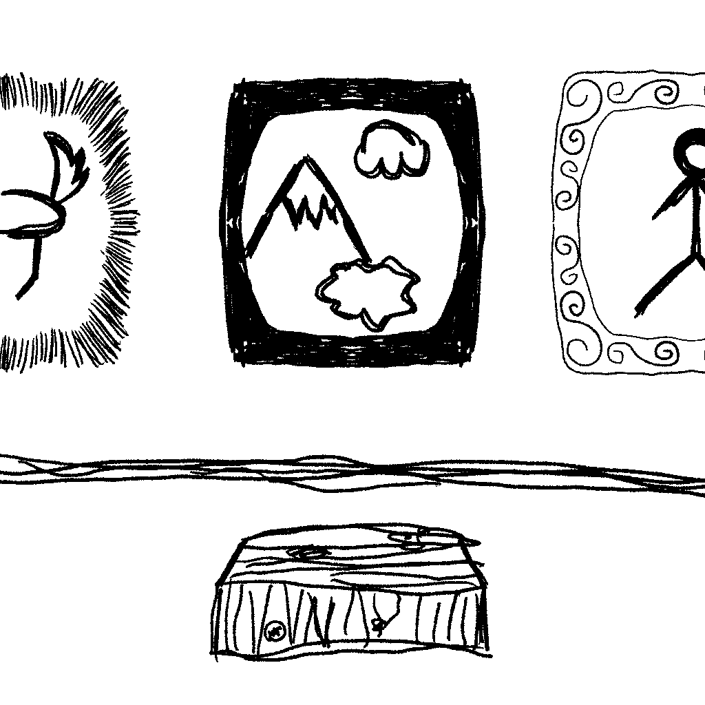

.. Exhibition documentation master file, created by
   sphinx-quickstart on Mon Jun 25 23:31:32 2018.
   You can adapt this file completely to your liking, but it should at least
   contain the root `toctree` directive.

Welcome to Exhibition's documentation!
======================================

.. include:: ../README.rst
  :start-after: inclusion-marker-do-not-remove-start
  :end-before: inclusion-marker-do-not-remove-end

.. toctree::
   :maxdepth: 2
   :caption: Contents:

   getting-started
   commandline
   meta
   filters
   Exhibition API Guide <modules>
   security
   changelog

Indices and tables
==================

* :ref:`genindex`
* :ref:`modindex`
* :ref:`search`
